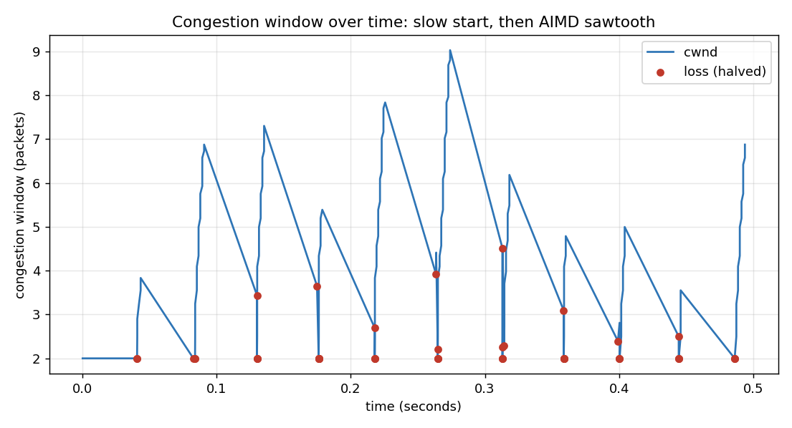

# Reliable Transport Protocol over Raw UDP

TCP's core reliability guarantees, implemented from scratch on top of raw
UDP, in Python. UDP gives you fast, unreliable, unordered, connectionless
delivery — this project builds everything TCP adds on top of that: reliable
delivery, ordering, pipelining, congestion control, and a real connection
lifecycle.

Built in five phases, each independently runnable and tested.



*Slow start ramps the congestion window up fast, then AIMD takes over:
climb, hit a loss, halve, climb again — TCP's classic sawtooth, reproduced
here from a real, lossy UDP transfer.*

## What it does

- **Packet framing + a lossy-channel simulator** — a configurable wrapper
  that deliberately drops, duplicates, and reorders packets, so reliability
  can actually be tested (real UDP on localhost essentially never fails on
  its own).
- **Stop-and-wait reliable delivery** — the core proof: every byte arrives
  exactly once, in order, even under 30%+ simulated loss.
- **Sliding window / pipelining** — many packets in flight at once, cumulative
  ACKs, out-of-order reassembly — roughly a 7x throughput improvement over
  stop-and-wait under identical loss.
- **Congestion control** — slow start (exponential ramp-up) plus AIMD
  (halve on loss, grow linearly after), producing TCP's classic sawtooth.
- **A real connection lifecycle** — a 3-way handshake (SYN/SYN-ACK/ACK)
  before data flows and a FIN/FIN-ACK teardown after, both reliable under
  loss like everything else here.

## Architecture

```
Phase 1: Packet + LossyChannel        (framing, checksums, failure injection)
Phase 2: StopAndWaitSender/Receiver   (the core reliability proof)
Phase 3: SlidingWindowSender/Receiver (pipelining, cumulative ACKs)
Phase 4: CongestionControlledSender   (slow start + AIMD on top of Phase 3's receiver)
Phase 5: Connection (handshake + data + teardown) + the full 3-way benchmark
```

Each later phase reuses the earlier phases' already-hardened pieces rather
than re-deriving similar logic — Phase 4's sender reuses Phase 3's receiver
unchanged, for instance.

## Phases

| Phase | Adds | Key idea |
|-------|------|----------|
| **1** | packet framing + lossy channel | can't test reliability without breaking things |
| **2** | stop-and-wait | exactly-once, in-order delivery — the core proof |
| **3** | sliding window | pipelining — measured ~7x throughput |
| **4** | congestion control | slow start + AIMD, the classic sawtooth |
| **5** | handshake/teardown + full comparison | a real connection, and what each layer bought |

Each phase has its own README with the details.

## Quick start

```bash
pip install -r requirements.txt   # matplotlib is the only non-stdlib dependency

python transport_phase1.py   # framing + lossy-channel demo
python transport_phase2.py   # stop-and-wait: 30 packets under 30% drop + 10% dup
python transport_phase3.py   # sliding window vs. stop-and-wait throughput
python transport_phase4.py   # congestion control: produces the sawtooth chart
python transport_phase5.py   # handshake+teardown demo, then the full 3-way benchmark
```

## Headline results

**Sliding window vs. stop-and-wait (Phase 3):** ~7x throughput improvement
under identical simulated loss, purely from pipelining.

**The full comparison (Phase 5):**
```
    loss |  stop&wait |  sliding-window |  cong-controlled   (pkts/sec)
  --------------------------------------------------------------
      0% |      827.5 |          5881.6 |           6937.1
     10% |       76.5 |           354.4 |            303.2
     20% |       32.8 |           163.0 |             97.3
     30% |       18.7 |           114.6 |             45.4
```
Congestion control **wins at low loss** by growing its window well past
sliding window's fixed size — but **loses at high loss**, because AIMD
assumes loss means congestion and backs off hard in response. In this
simulated channel, loss is random, not congestive, so congestion control
keeps punishing itself for noise a fixed window just rides through. A real,
known limitation of loss-based congestion control, reproduced here with data.

## Tests

Every phase ships tests, and each one is stress-tested well past "it passed
once" — several phases surfaced genuine intermittent, timing-dependent bugs
that only repeated runs under real (unseeded) randomness could catch.

```bash
python test_phase1.py   # framing + lossy-channel injection, verified from the receiver's side
python test_phase2.py   # reliable delivery, duplicate suppression, give-up on a dead channel
python test_phase3.py   # pipelining, window-size invariant, out-of-order reassembly
python test_phase4.py   # slow start / AIMD logic, plus 8 repeated real lossy transfers
python test_phase5.py   # handshake/teardown, full connection lifecycle, 10 repeated real transfers
```

## Tech stack

- Python (`asyncio`, raw `socket`)
- `matplotlib` for the sawtooth and comparison charts
- `pytest`-style assertions (plain `assert`, no framework dependency)

## Design notes (interview-relevant)

- **A lossy-channel simulator is the foundation everything else depends on**,
  and its own failure injection is verified from the *receiver's* side — a
  simulator that only proves itself via its own bookkeeping proves nothing.
- **A "waiting" side must never have less patience than the "retrying" side
  it's waiting on.** Several real bugs across this project (see the phase
  READMEs) came down to violations of exactly this principle — the fix is
  never picking matching constants by hand in separate places, it's having
  one shared source of truth everything derives from.
- **Loss-based congestion control has a real, demonstrable weakness**: it
  can't tell random packet loss from actual network congestion, and backs
  off in both cases — visible directly in this project's own benchmark data.

## License

MIT (or your choice).
