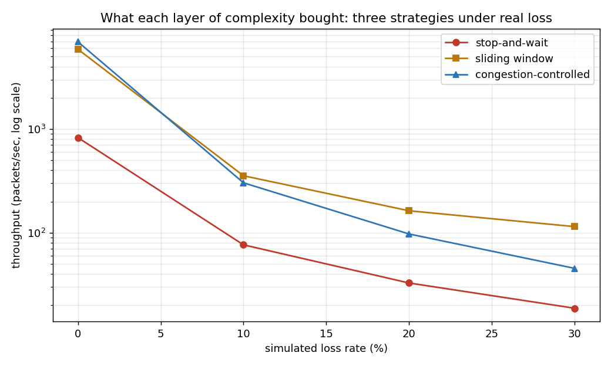

# Reliable Transport Protocol — Phase 5 (Final)

The finale: a real connection **lifecycle** (handshake, then teardown) and
the full three-way benchmark comparing everything built across all five
phases, on one chart.

## Files
- `transport_phase5.py` — handshake, teardown, `Connection`, the benchmark, demo
- `test_phase5.py` — tests
- `transport_comparison.png` — the three-way throughput comparison

## Part 1: a real connection lifecycle

**Handshake** (`client_handshake` / `server_handshake`): the classic 3-way
exchange — `SYN` → `SYN-ACK` → `ACK` — establishes the connection before any
data flows, retried like any other packet if a step is lost.

**Teardown** (`sender_teardown` / `receiver_teardown`): once all data is
delivered and acked, the sender sends `FIN` and waits for `FIN-ACK` before
considering the connection closed — retried if lost, same as the handshake.

This **formalizes** what Phases 2–4 stood in for with an ad-hoc "linger"
period: instead of the receiver guessing how long to wait around in case its
last ACK was lost, the sender now explicitly says "I'm done" and the
connection isn't closed until that's acknowledged.

```python
client = Connection(sock, channel)
server = Connection(sock2, channel2)
await server.accept_and_receive(n)      # (as a concurrent task)
await client.connect_and_send(addr, payloads)   # handshake -> data -> teardown
```

## Part 2: the full comparison

```
    loss |  stop&wait |  sliding-window |  cong-controlled   (pkts/sec)
  --------------------------------------------------------------
      0% |      827.5 |          5881.6 |           6937.1
     10% |       76.5 |           354.4 |            303.2
     20% |       32.8 |           163.0 |             97.3
     30% |       18.7 |           114.6 |             45.4
```


**The honest, interesting finding:** congestion control **wins at low loss**
(6937 vs. 5882 pkts/sec at 0%) by growing its window well past sliding
window's fixed size of 8 — but **loses at high loss** (45 vs. 115 at 30%).
AIMD's whole design assumes *loss means congestion* and backs off hard in
response. In this simulated channel, loss is **not** congestion — it's
independent random drop — so congestion control keeps punishing itself for
noise a fixed window just rides through. This is a real, known critique of
loss-based congestion control (as opposed to delay-based or
explicitly-signaled approaches), and it's a genuinely more sophisticated
finding than "more complexity always wins."

## Building this phase: three real bugs, all one underlying lesson

Every prior phase in this project had, at most, one hard-won bug. This phase
had three — because a connection lifecycle has more independently-moving
parts (handshake, data, teardown) that can each race against each other in
ways a single data-transfer phase never could. All three turned out to be
variations on the same theme:

1. **A straggling retransmitted SYN-ACK collided with a data ACK.** Both
   carry the `ACK` flag; the data-receive loop only checked for that flag,
   not whether the packet was *also* a SYN or FIN in disguise. Fixed by
   requiring a **pure** ACK everywhere a sender checks for one, across all
   three sender implementations (Phases 2, 3, and 4) for consistency.
2. **The data-phase's own linger silently swallowed FIN**, because it
   correctly ignored non-data control packets but had nowhere to route them —
   so the *actual* teardown code, listening separately, never saw the FIN
   that was already consumed and discarded.
3. **Splitting "wait for a retransmitted data packet" and "wait for FIN"
   into two sequential phases left a timing gap no duration-tuning could
   close** — the sender might legitimately send either kind of packet during
   what should be one continuous window, and whichever phase wasn't running
   at that exact moment couldn't respond. Fixed by merging both into **one**
   loop that recognizes both packet types for a single shared patience
   window — with `Connection` as the one source of truth for the
   timeout/retry budget everything else derives from, rather than separate
   constants that could silently drift out of sync.

The common thread across all three, and arguably across every bug found in
this entire project: **a "waiting" side must never have less patience than
the "retrying" side it's waiting on** — and the cleanest way to guarantee
that isn't picking matching constants by hand in several places, it's having
one shared source of truth that everything derives from.

## Run
```bash
pip install matplotlib
python transport_phase5.py   # handshake+teardown demo, then the full benchmark
python test_phase5.py        # tests
```
The benchmark takes about a minute (30 real, lossy transfers across 4 loss
rates × 3 strategies × 2 trials).

## Tests cover
- handshake succeeds at zero loss and under 25% loss
- teardown succeeds under 25% loss (doesn't hang, doesn't raise)
- a full connection (handshake → data → teardown) succeeds at zero loss and
  under 20% loss
- **`test_repeated_connections_are_robust`**: 10 consecutive unseeded, real,
  lossy end-to-end connections in one test — the permanent guard against the
  exact bug class described above
- the benchmark itself produces sane results: positive throughput everywhere,
  throughput drops as loss increases for every strategy, and both windowed
  strategies clearly beat stop-and-wait at zero loss

## Verification beyond the test suite
Given how many rounds of debugging this phase needed, it was stress-tested
well past "the tests passed once": roughly 90 additional unseeded end-to-end
connections run manually across a range of conditions (20–40% loss, transfer
sizes from 15–40 packets), including the harsh 40% loss condition — zero
failures since the final fix.

## The whole project, recapped
| Phase | Adds | Key idea |
|-------|------|----------|
| 1 | framing + lossy channel | can't test reliability without breaking things |
| 2 | stop-and-wait | the core reliability proof: exactly-once, in-order |
| 3 | sliding window | pipelining — measured ~7x throughput |
| 4 | congestion control | slow start + AIMD, the classic sawtooth |
| 5 | lifecycle + full comparison | a real connection, and what each layer bought |

**The interview narrative:** *"I implemented TCP's core guarantees over raw
UDP — reliable in-order delivery, a sliding window for throughput, slow-start
and AIMD congestion control, and a real connection lifecycle with handshake
and teardown — then benchmarked all three delivery strategies together and
found that congestion control actually underperforms a simple fixed window
under high, non-congestive loss, which is a real, known limitation of
loss-based congestion control."* That's evidence, not a recitation — and the
nuanced finding is a stronger signal than a naive "it always wins" would have
been.
